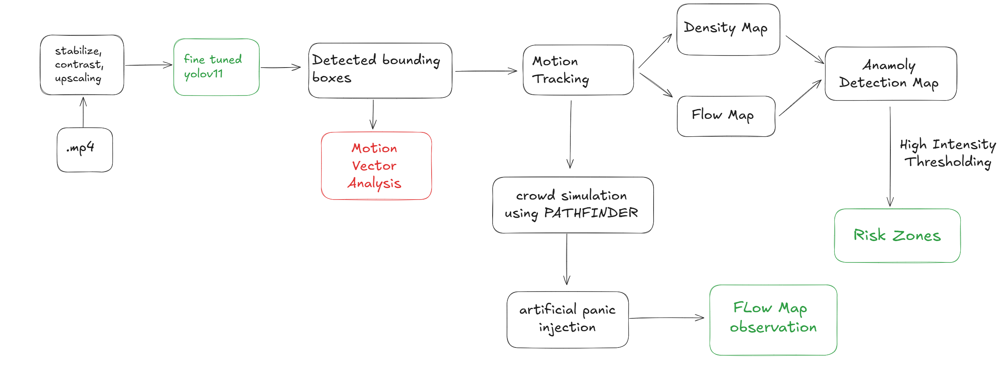

<h1 align="center"> Pikachoo AI </h1>
<div align="center">
  
</div>

[](https://pypi.org/project/ultralytics/)
[](https://pypi.org/project/opencv-python/)
[](https://pypi.org/project/PyYAML/)
[](https://pypi.org/project/fastapi/)
[](https://pypi.org/project/uvicorn/)
[](https://pypi.org/project/python-multipart/)
[](https://pypi.org/project/lap/)
[](https://pypi.org/project/aiortc/)
[](https://pypi.org/project/rich/)
[](https://pypi.org/project/google-auth/)
[](https://pypi.org/project/google-auth-oauthlib/)
[](https://pypi.org/project/google-auth-httplib2/)
[](https://pypi.org/project/python-dotenv/)
[](https://pypi.org/project/google-api-python-client/)


## 📚 Table of Contents
- [Download app](#download-app)
- [Pipeline](#pipeline)
- [Demo](#demo)
  - [Object Detection Demo](#object-detection-demo)
  - [Demo of Tracking Path](#track-path-demo)
  - [Demo of velocity map](#velocity-map-demo)
  - [Demo of anamoly detection](#anamoly-detection-demo)
<!-- - [Data Preparation](#data-preparation) -->
- [Setting project locally](#setting-up-project-locally)
  - [Setting up backend locally](#setting-up-backend)
  - [Setting up frontend locally](#setting-up-frontend)

## Download app


## Pipeline 


## Demo
### Object Detection Demo


### Track Path Demo

### Velocity Map Demo


### Anamoly Detection

## Setting project locally

### Setting up backend 
- Cloning the repo **https:github.com:Davda-James/pikachu.git**
```bash
git clone https:github.com:Davda-James/pikachu.git
```
- Change the working directory
```bash
cd pikachu
```
- Creating python virtual environment
```bash
python -m venv venv
```
- Activate python virtual environment
  - For linux 
  ```bash
  source venv/bin/activate
  ```
  - For windows
  ```bash
  venv/scripts/activate
  ```
- Install requirements
```bash
pip install -r requirements.txt
```
- Starting backend fastapi server
```bash
uvicorn pikachu.app:app --host 0.0.0.0 --port 8000
```

## Setting up gmail service account
- Visit **https://github.com/Davda-James/InboxGenie/blob/main/README.md**
- Follow above README (skip GEMINI API portion as not needed here)
- Store credentials.json in root directory pikachu

## Setting up frontend
- No need have direct download apk, download from below
- Link to **github** frontend [Frontend](https://github.com/Davda-James/pikachu_frontend.git) if wanted to visit. 
